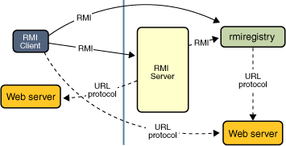

# Dynamic-Web-Rmi

In this repository we will be taking a look at making a dynamic web application in eclipse.
The main technologies used to achieve our wanted outcome are: Eclipse, Apache Tomcat and lastly RabbitMQ.

We will be focusing on using Java RMI(Remote Method Invocation), a Java API that lets us perform remote method invoaction.

Rmi can be seen in Client, Server and ServerSetup in this project.

RabbitMQ is an open source message broker. We use it for adding tasks to a queue.
Hopefully you will have a better understanding of RabbitMQ with the use of the image below.

